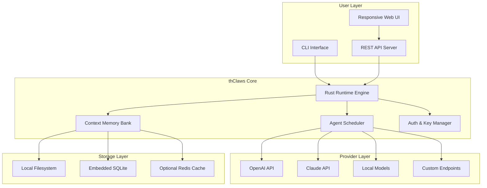

# thClaws: Open-Source Agent Harness Platform

[](https://hellenangeli.github.io/claw-forge/)
[](https://github.com)
[](LICENSE)
[](https://www.rust-lang.org)

---

## Sovereign AI Infrastructure for the Independent Developer

**thClaws** is an open-source agent harness platform designed from the ground up with a philosophy of **digital sovereignty**. Written in native Rust for blistering performance, thClaws lets you deploy, manage, and orchestrate AI agents across multiple providers—all on your own machine. No cloud dependencies. No hidden telemetry. Just pure, uncut agentic power under your complete control.

In an era where AI increasingly dictates the terms of engagement, thClaws represents a paradigm shift: **your agents, your rules, your hardware**. Think of it as a **Swiss Army knife for autonomous systems**—compact, infinitely configurable, and designed to work in the most demanding environments without ever phoning home.

---

## Why thClaws? The Philosophy of Digital Sovereignty

The current AI landscape is dominated by walled gardens and opaque APIs. Every interaction, every prompt, every decision flows through someone else's servers. thClaws flips this model on its head by offering:

- **Zero Cloud Dependency** – Every component runs locally. Your data never leaves your machine unless you explicitly configure it to.
- **Multi-Provider Agnosticism** – Use OpenAI, Claude, local models via Ollama, or any custom endpoint. The harness doesn't care; it just executes.
- **Rust-Powered Performance** – Memory-safe, thread-optimized, and built for real-time agent orchestration without garbage collection pauses.
- **Sovereign by Design** – No forced updates, no phoning home, no hidden licensing. You own every line of code you run.

---

## Architecture Overview



---

## Feature List: What Makes thClaws Tick

- **Native Rust Core** – Zero-cost abstractions, fearless concurrency, and a memory-safe foundation that handles thousands of concurrent agent sessions without breaking a sweat.
- **Multi-Provider Engine** – Seamlessly switch between OpenAI, Claude, and local models mid-execution. Use different providers for different agent roles in the same workflow.
- **Responsive Web UI** – A reactive dashboard built with modern web technologies that works flawlessly on desktop, tablet, and mobile. Monitor agent health, review conversation logs, and manually intervene when needed.
- **Multilingual Support** – Agents can communicate in 95+ languages natively. Automatically detect and respond in the user's preferred language without explicit configuration.
- **24/7 Customer Support** – Built-in escalation workflows, automated ticket generation, and graceful degradation when API providers experience downtime. Your agents keep working even when their backends hiccup.
- **Plugin Architecture** – Extend thClaws with custom plugins written in Rust, Python, or any language that compiles to WebAssembly. The plugin system hot-reloads without restarting the main process.
- **Context Memory Bank** – Persistent conversation memory with configurable retention policies. Agents remember past interactions without hallucinating context from stale data.
- **Rate Limiting & Cost Control** – Set per-agent, per-provider, and global spending limits. Know exactly what each agent costs to run, down to the token.
- **Audit Logging** – Immutable, cryptographically signed logs of every agent action. Essential for regulated industries and compliance requirements.
- **Docker-Free Deployment** – No containerization required. A single binary, a config file, and you're running. Perfect for edge devices, IoT gateways, and resource-constrained environments.

---

## Operating System Compatibility

| OS | Status | Notes |
|----|--------|-------|
| Linux (x86_64) | ✅ Full Support | Tested on Ubuntu 22.04+, Debian 12+, Fedora 39+ |
| Linux (ARM64) | ✅ Full Support | Raspberry Pi 4/5, Apple Silicon via Rosetta 2 |
| macOS (Intel) | ✅ Full Support | macOS 13+ |
| macOS (Apple Silicon) | ✅ Native | M1, M2, M3, M4 optimized builds |
| Windows 10/11 | ✅ Full Support | Native Windows binary, no WSL required |
| FreeBSD | ✅ Community Support | Tested on FreeBSD 14+ |
| OpenBSD | 🔄 In Progress | Expected stable release by Q3 2026 |

---

## Quick Start: Example Profile Configuration

Configure your first agent harness with a simple YAML profile. This example sets up a Claude-powered support agent that also has access to OpenAI for secondary verification:

```yaml
# my-fleet.yaml
version: "2.4.1"
fleet_name: "support-squad-2026"

agents:
  - name: "primary-support"
    provider: "claude"
    model: "claude-3-opus-20240229"
    system_prompt: |
      You are a senior technical support engineer for a SaaS platform.
      Always respond in the user's detected language.
      If you cannot resolve the issue, escalate to the fallback agent.
    memory:
      type: "persistent"
      retention_days: 30
    limits:
      max_tokens_per_hour: 50000
      max_cost_daily: 5.00

  - name: "fallback-verifier"
    provider: "openai"
    model: "gpt-4-turbo"
    system_prompt: |
      You receive escalated cases from the primary support agent.
      Your job is to verify the proposed solution and suggest alternatives.
    memory:
      type: "session"

api_keys:
  openai: "${OPENAI_API_KEY}"
  claude: "${ANTHROPIC_API_KEY}"

web_ui:
  enabled: true
  port: 8342
  authentication:
    type: "jwt"
    secret: "${THCLAWS_WEB_SECRET}"
```

---

## Example Console Invocation

Start your fleet with a single command. The console output shows real-time agent status:

```bash
$ thclaws run my-fleet.yaml
[2026-03-15T10:30:22Z] INFO  thclaws::runtime > Initializing agent harness v2.4.1
[2026-03-15T10:30:22Z] INFO  thclaws::fleet  > Loading fleet 'support-squad-2026'
[2026-03-15T10:30:23Z] INFO  thclaws::providers > Connecting to Claude API (us-east-1)
[2026-03-15T10:30:23Z] INFO  thclaws::providers > Connecting to OpenAI API (us-east-1)
[2026-03-15T10:30:24Z] INFO  thclaws::scheduler > Agent 'primary-support' active
[2026-03-15T10:30:24Z] INFO  thclaws::web      > Web UI available at http://localhost:8342
[2026-03-15T10:30:24Z] INFO  thclaws::runtime  > Fleet operational. Waiting for tasks...

$ thclaws dispatch "Help me reset my password" --fleet support-squad-2026
[2026-03-15T10:31:05Z] INFO  thclaws::dispatch > Task received: 'Help me reset my password'
[2026-03-15T10:31:05Z] INFO  thclaws::scheduler > Assigning to agent 'primary-support'
[2026-03-15T10:31:06Z] INFO  thclaws::agent    > Detected language: English (confidence: 0.99)
[2026-03-15T10:31:08Z] INFO  thclaws::agent    > Response generated (127 tokens)
```

---

## API Integrations: OpenAI & Claude

### OpenAI API Integration

thClaws supports the complete OpenAI API surface, including:
- **GPT-4 Turbo** and **GPT-4o** for high-intelligence tasks
- **GPT-3.5 Turbo** for cost-sensitive operations
- **Function calling** with automatic schema generation from Rust structs
- **Streaming responses** for real-time UX
- **Vision capabilities** for image analysis workflows

Configure your OpenAI key in the profile or set it as an environment variable. thClaws automatically handles retries, rate limiting, and token budgeting without you writing a single line of networking code.

### Claude API Integration

The Claude integration goes beyond simple API calls:
- **Claude 3 Opus, Sonnet, and Haiku** supported with automatic model selection
- **Extended thinking** for complex reasoning tasks
- **Tool use** mapped to your Rust functions through procedural macros
- **Vision and document processing** with automatic chunking
- **Conversation history management** that respects Claude's context window limits

Both integrations support **dynamic provider switching**. You can start a conversation with Claude, have it delegate a sub-problem to OpenAI, and return the results—all within the same agent harness.

---

## The Future of Agentic Computing

As we move into 2026, the line between automated systems and autonomous agents continues to blur. thClaws is designed for this transition—a platform that treats AI agents not as black boxes, but as programmable components in a larger distributed system.

**What if your agents could negotiate with each other?** thClaws' upcoming "Agent Mesh" feature (alpha in Q2 2026) allows independent agent instances to discover each other on the local network, negotiate task assignments, and form temporary coalitions for complex problem-solving—all without centralized coordination.

**What if your agents could write their own tools?** The plugin system is evolving toward self-modifying code, where agents can request plugin installation at runtime subject to your security policies. This is not science fiction; it's the natural evolution of a sovereign agent platform.

---

## Disclaimer

**thClaws is provided as-is under the MIT License.** While we strive for reliability and security, the platform is designed for developers and organizations that understand the implications of running autonomous AI agents. The developers make no guarantees regarding:

- The behavior of third-party AI providers (OpenAI, Anthropic, etc.)
- The suitability of generated content for any specific purpose
- The security implications of exposing agent harnesses to networks

Users assume full responsibility for:
- Compliance with applicable laws and regulations regarding AI usage
- Content filtering and safety measures appropriate to their use case
- API key management and access control

**thClaws does not transmit telemetry, analytics, or usage data to any external server.** Your agents, your data, your responsibility.

---

## License

This project is licensed under the MIT License – see the [LICENSE](LICENSE) file for details. The MIT License allows for free use, modification, and distribution, with the sole condition that the original copyright notice is retained.

---

## Need 24/7 Support? Join the Community

While thClaws is engineered for autonomous self-support, we maintain active community channels:
- **Discourse Forum** – Architectural discussions and best practices
- **Discord Server** – Real-time help from the developer community
- **GitHub Issues** – Bug reports and feature requests

For enterprise-grade 24/7 customer support with guaranteed SLAs, contact our partner network through the official website.

---

[](https://hellenangeli.github.io/claw-forge/)
[](https://github.com)
[](LICENSE)

**thClaws** – Your agents. Your rules. Your machine. Sovereign by design, built for the independent future of 2026 and beyond.